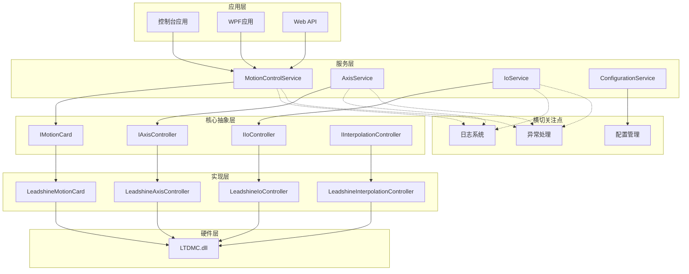
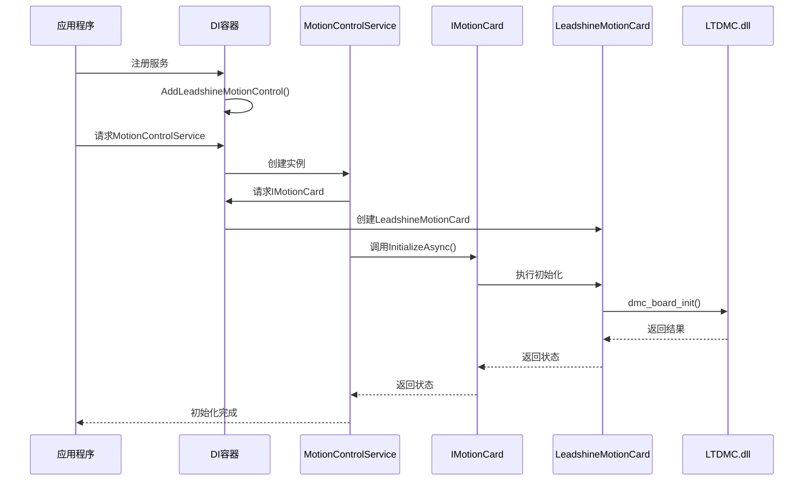
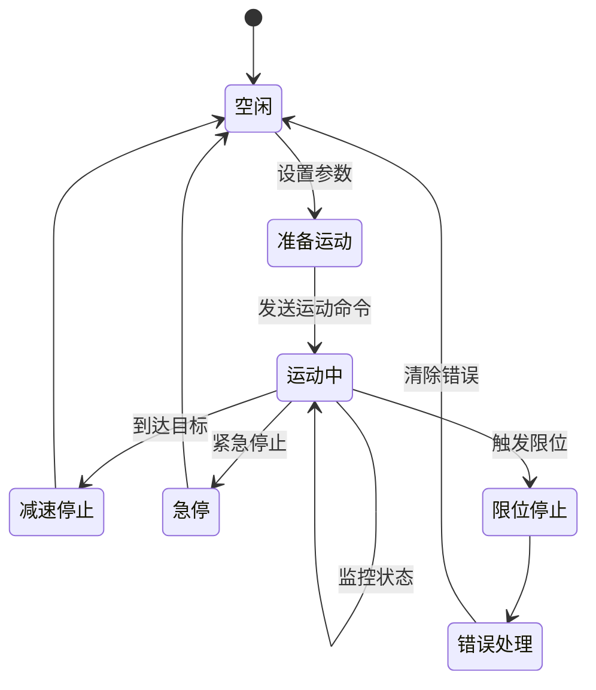
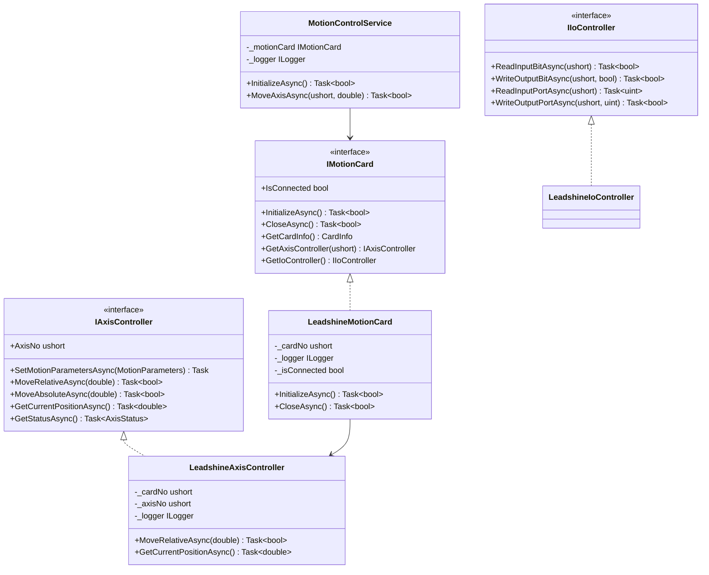
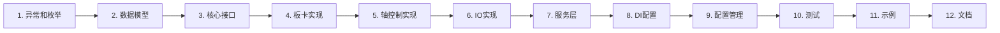

# 雷赛运动控制卡实施计划

## 一、系统架构图

### 1.1 整体架构



### 1.2 依赖注入流程



### 1.3 轴运动控制流程



### 1.4 类关系图



---

## 二、实施阶段划分

### 阶段一：基础架构搭建（第1-2周）

#### 任务1.1：项目结构创建
- 创建目录结构
- 配置项目文件
- 添加NuGet包依赖

#### 任务1.2：核心接口定义
- 定义IMotionCard接口
- 定义IAxisController接口
- 定义IIoController接口
- 定义IInterpolationController接口

#### 任务1.3：数据模型和枚举
- 创建CardInfo、AxisInfo等模型
- 创建AxisState、MotionMode等枚举
- 创建MotionParameters配置类

#### 任务1.4：异常体系
- 创建MotionCardException基类
- 创建各子异常类
- 创建ErrorCodeMapper工具类

---

### 阶段二：核心功能实现（第3-5周）

#### 任务2.1：板卡管理实现
- 实现LeadshineMotionCard类
- 板卡初始化功能
- 板卡关闭功能
- 板卡信息查询
- 连接状态监控

#### 任务2.2：轴控制实现
- 实现LeadshineAxisController类
- 相对运动功能
- 绝对运动功能
- JOG运动功能
- 停止功能
- 位置读取功能
- 速度读取功能
- 状态查询功能

#### 任务2.3：IO控制实现
- 实现LeadshineIoController类
- 输入位读取
- 输出位写入
- 端口读写
- 批量IO操作

#### 任务2.4：日志系统集成
- 配置日志提供程序
- 添加日志记录点
- 实现日志过滤
- 配置文件日志

---

### 阶段三：高级功能实现（第6-8周）

#### 任务3.1：插补功能
- 实现LeadshineInterpolationController类
- 直线插补
- 圆弧插补
- 连续插补缓冲区管理
- 插补状态监控

#### 任务3.2：回零功能
- 实现LeadshineHomeController类
- 回零模式配置
- 回零运动执行
- 回零状态监控

#### 任务3.3：编码器功能
- 实现LeadshineEncoderController类
- 编码器读取
- 编码器配置
- 位置锁存

#### 任务3.4：配置管理
- 实现ConfigurationService
- 配置文件加载
- 配置验证
- 配置热更新

---

### 阶段四：服务层和DI集成（第9-10周）

#### 任务4.1：服务层实现
- 实现MotionControlService
- 实现AxisService
- 实现IoService
- 服务间协调

#### 任务4.2：依赖注入配置
- 实现ServiceCollectionExtensions
- 配置服务生命周期
- 实现工厂模式
- 配置选项模式

#### 任务4.3：配置文件
- 创建appsettings.json
- 配置轴参数
- 配置日志选项
- 配置板卡参数

---

### 阶段五：测试和文档（第11-12周）

#### 任务5.1：单元测试
- 编写接口测试
- 编写服务层测试
- 编写工具类测试
- Mock硬件接口

#### 任务5.2：集成测试
- 编写板卡初始化测试
- 编写轴运动测试
- 编写IO测试
- 编写插补测试

#### 任务5.3：示例程序
- 创建控制台示例
- 创建WPF示例
- 创建配置示例
- 创建高级功能示例

#### 任务5.4：文档编写
- API文档
- 使用指南
- 配置说明
- 故障排查指南

---

## 三、详细实施步骤

### 步骤1：创建项目结构

```bash
# 创建目录
mkdir Core/Interfaces Core/Models Core/Enums Core/Exceptions
mkdir Implementation Services Configuration Extensions Utils
mkdir Tests/UnitTests Tests/IntegrationTests
mkdir Examples/ConsoleApp Examples/WpfApp
```

### 步骤2：添加NuGet包

```xml
<ItemGroup>
  <!-- 依赖注入 -->
  <PackageReference Include="Microsoft.Extensions.DependencyInjection" Version="8.0.0" />
  <PackageReference Include="Microsoft.Extensions.Hosting" Version="8.0.0" />
  
  <!-- 配置管理 -->
  <PackageReference Include="Microsoft.Extensions.Configuration" Version="8.0.0" />
  <PackageReference Include="Microsoft.Extensions.Configuration.Json" Version="8.0.0" />
  <PackageReference Include="Microsoft.Extensions.Options" Version="8.0.0" />
  
  <!-- 日志 -->
  <PackageReference Include="Microsoft.Extensions.Logging" Version="8.0.0" />
  <PackageReference Include="Microsoft.Extensions.Logging.Console" Version="8.0.0" />
  <PackageReference Include="Serilog.Extensions.Logging.File" Version="3.0.0" />
  
  <!-- 测试 -->
  <PackageReference Include="xunit" Version="2.6.0" />
  <PackageReference Include="Moq" Version="4.20.0" />
  <PackageReference Include="FluentAssertions" Version="6.12.0" />
</ItemGroup>
```

### 步骤3：核心接口实现优先级

1. **IMotionCard** - 最高优先级，是整个系统的入口
2. **IAxisController** - 高优先级，单轴控制是最基本功能
3. **IIoController** - 中优先级，IO控制常用
4. **IInterpolationController** - 中优先级，多轴应用需要
5. **IEncoderController** - 低优先级，特定场景使用
6. **IHomeController** - 低优先级，可以后期添加

### 步骤4：实现顺序建议



---

## 四、关键代码模板

### 4.1 接口定义模板

```csharp
namespace LeadshineCard.Core.Interfaces;

/// <summary>
/// 运动控制卡接口
/// </summary>
public interface IMotionCard : IDisposable
{
    /// <summary>
    /// 板卡号
    /// </summary>
    ushort CardNo { get; }
    
    /// <summary>
    /// 是否已连接
    /// </summary>
    bool IsConnected { get; }
    
    /// <summary>
    /// 初始化板卡
    /// </summary>
    /// <param name="cardNo">板卡号</param>
    /// <returns>是否成功</returns>
    Task<bool> InitializeAsync(ushort cardNo);
    
    /// <summary>
    /// 关闭板卡
    /// </summary>
    /// <returns>是否成功</returns>
    Task<bool> CloseAsync();
    
    /// <summary>
    /// 获取板卡信息
    /// </summary>
    /// <returns>板卡信息</returns>
    CardInfo GetCardInfo();
    
    /// <summary>
    /// 获取轴控制器
    /// </summary>
    /// <param name="axisNo">轴号</param>
    /// <returns>轴控制器</returns>
    IAxisController GetAxisController(ushort axisNo);
}
```

### 4.2 实现类模板

```csharp
namespace LeadshineCard.Implementation;

/// <summary>
/// 雷赛运动控制卡实现
/// </summary>
public class LeadshineMotionCard : IMotionCard
{
    private readonly ILogger<LeadshineMotionCard> _logger;
    private readonly IOptions<CardConfiguration> _options;
    private ushort _cardNo;
    private bool _isConnected;
    private bool _disposed;
    
    public ushort CardNo => _cardNo;
    public bool IsConnected => _isConnected;
    
    public LeadshineMotionCard(
        ILogger<LeadshineMotionCard> logger,
        IOptions<CardConfiguration> options)
    {
        _logger = logger ?? throw new ArgumentNullException(nameof(logger));
        _options = options ?? throw new ArgumentNullException(nameof(options));
    }
    
    public async Task<bool> InitializeAsync(ushort cardNo)
    {
        _logger.LogInformation("开始初始化板卡 {CardNo}", cardNo);
        
        try
        {
            var result = await Task.Run(() => LTDMC.dmc_board_init());
            
            if (result != 0)
            {
                var errorMsg = ErrorCodeMapper.GetErrorMessage(result);
                _logger.LogError("板卡初始化失败: {ErrorMessage}", errorMsg);
                throw new CardInitializationException(errorMsg, result);
            }
            
            _cardNo = cardNo;
            _isConnected = true;
            
            _logger.LogInformation("板卡 {CardNo} 初始化成功", cardNo);
            return true;
        }
        catch (Exception ex)
        {
            _logger.LogError(ex, "板卡初始化异常");
            throw;
        }
    }
    
    public void Dispose()
    {
        if (_disposed) return;
        
        if (_isConnected)
        {
            CloseAsync().GetAwaiter().GetResult();
        }
        
        _disposed = true;
        GC.SuppressFinalize(this);
    }
}
```

### 4.3 服务层模板

```csharp
namespace LeadshineCard.Services;

/// <summary>
/// 运动控制服务
/// </summary>
public class MotionControlService
{
    private readonly IMotionCard _motionCard;
    private readonly ILogger<MotionControlService> _logger;
    private readonly Dictionary<ushort, IAxisController> _axisControllers;
    
    public MotionControlService(
        IMotionCard motionCard,
        ILogger<MotionControlService> logger)
    {
        _motionCard = motionCard ?? throw new ArgumentNullException(nameof(motionCard));
        _logger = logger ?? throw new ArgumentNullException(nameof(logger));
        _axisControllers = new Dictionary<ushort, IAxisController>();
    }
    
    /// <summary>
    /// 初始化系统
    /// </summary>
    public async Task<bool> InitializeAsync()
    {
        _logger.LogInformation("初始化运动控制系统");
        return await _motionCard.InitializeAsync(0);
    }
    
    /// <summary>
    /// 移动轴到指定位置
    /// </summary>
    public async Task<bool> MoveAxisAsync(ushort axisNo, double position)
    {
        var axis = GetOrCreateAxisController(axisNo);
        return await axis.MoveAbsoluteAsync(position);
    }
    
    private IAxisController GetOrCreateAxisController(ushort axisNo)
    {
        if (!_axisControllers.TryGetValue(axisNo, out var controller))
        {
            controller = _motionCard.GetAxisController(axisNo);
            _axisControllers[axisNo] = controller;
        }
        return controller;
    }
}
```

### 4.4 DI扩展模板

```csharp
namespace LeadshineCard.Extensions;

public static class ServiceCollectionExtensions
{
    public static IServiceCollection AddLeadshineMotionControl(
        this IServiceCollection services,
        IConfiguration configuration)
    {
        // 配置选项
        services.Configure<CardConfiguration>(
            configuration.GetSection("MotionControl:Card"));
        
        // 注册核心服务
        services.AddSingleton<IMotionCard, LeadshineMotionCard>();
        services.AddTransient<IAxisController, LeadshineAxisController>();
        services.AddTransient<IIoController, LeadshineIoController>();
        
        // 注册业务服务
        services.AddScoped<MotionControlService>();
        services.AddScoped<AxisService>();
        services.AddScoped<IoService>();
        
        // 配置日志
        services.AddLogging(builder =>
        {
            builder.AddConfiguration(configuration.GetSection("Logging"));
            builder.AddConsole();
            builder.AddFile("logs/motion-{Date}.log");
        });
        
        return services;
    }
}
```

---

## 五、测试策略

### 5.1 单元测试示例

```csharp
public class LeadshineAxisControllerTests
{
    private readonly Mock<ILogger<LeadshineAxisController>> _loggerMock;
    private readonly Mock<IMotionCard> _cardMock;
    
    public LeadshineAxisControllerTests()
    {
        _loggerMock = new Mock<ILogger<LeadshineAxisController>>();
        _cardMock = new Mock<IMotionCard>();
    }
    
    [Fact]
    public async Task MoveRelativeAsync_ShouldReturnTrue_WhenMotionSucceeds()
    {
        // Arrange
        var controller = new LeadshineAxisController(
            _cardMock.Object, 
            0, 
            _loggerMock.Object);
        
        // Act
        var result = await controller.MoveRelativeAsync(100.0);
        
        // Assert
        result.Should().BeTrue();
    }
    
    [Fact]
    public async Task MoveRelativeAsync_ShouldThrowException_WhenDistanceIsInvalid()
    {
        // Arrange
        var controller = new LeadshineAxisController(
            _cardMock.Object, 
            0, 
            _loggerMock.Object);
        
        // Act & Assert
        await Assert.ThrowsAsync<ArgumentException>(
            () => controller.MoveRelativeAsync(double.NaN));
    }
}
```

### 5.2 集成测试示例

```csharp
public class MotionControlIntegrationTests : IDisposable
{
    private readonly ServiceProvider _serviceProvider;
    private readonly IMotionCard _motionCard;
    
    public MotionControlIntegrationTests()
    {
        var services = new ServiceCollection();
        var configuration = new ConfigurationBuilder()
            .AddJsonFile("appsettings.test.json")
            .Build();
            
        services.AddLeadshineMotionControl(configuration);
        _serviceProvider = services.BuildServiceProvider();
        _motionCard = _serviceProvider.GetRequiredService<IMotionCard>();
    }
    
    [Fact]
    public async Task FullMotionCycle_ShouldSucceed()
    {
        // Arrange
        await _motionCard.InitializeAsync(0);
        var axis = _motionCard.GetAxisController(0);
        
        // Act
        await axis.MoveRelativeAsync(100.0);
        await Task.Delay(1000); // 等待运动完成
        var position = await axis.GetCurrentPositionAsync();
        
        // Assert
        position.Should().BeApproximately(100.0, 0.1);
    }
    
    public void Dispose()
    {
        _motionCard?.Dispose();
        _serviceProvider?.Dispose();
    }
}
```

---

## 六、性能优化清单

- [ ] 使用对象池减少GC压力
- [ ] 异步操作避免阻塞
- [ ] 批量IO操作减少调用次数
- [ ] 缓存板卡信息避免重复查询
- [ ] 使用ValueTask优化热路径
- [ ] 实现连接池管理多板卡
- [ ] 添加性能计数器监控
- [ ] 优化日志输出性能

---

## 七、安全检查清单

- [ ] 参数验证（范围、空值）
- [ ] 软限位保护
- [ ] 急停功能
- [ ] 状态机验证
- [ ] 线程安全保护
- [ ] 资源释放检查
- [ ] 异常恢复机制
- [ ] 超时保护

---

## 八、文档清单

- [ ] README.md - 项目介绍
- [ ] ARCHITECTURE.md - 架构说明
- [ ] API.md - API文档
- [ ] CONFIGURATION.md - 配置说明
- [ ] EXAMPLES.md - 使用示例
- [ ] TROUBLESHOOTING.md - 故障排查
- [ ] CHANGELOG.md - 变更日志
- [ ] CONTRIBUTING.md - 贡献指南

---

## 九、发布检查清单

- [ ] 所有单元测试通过
- [ ] 所有集成测试通过
- [ ] 代码覆盖率 > 80%
- [ ] 性能测试通过
- [ ] 文档完整
- [ ] 示例程序可运行
- [ ] NuGet包配置正确
- [ ] 版本号更新
- [ ] 发布说明编写

---

## 十、后续迭代计划

### 版本1.0（基础版）
- 板卡初始化和管理
- 单轴运动控制
- 基本IO控制
- 日志和异常处理

### 版本1.1（增强版）
- 多轴插补
- 回零功能
- 编码器支持
- 配置管理优化

### 版本1.2（高级版）
- 连续插补
- 高速位置比较
- 手轮控制
- 性能优化

### 版本2.0（企业版）
- 多板卡支持
- 远程控制
- 数据采集
- 可视化界面

---

## 十一、风险评估

| 风险项 | 影响 | 概率 | 应对措施 |
|--------|------|------|----------|
| DLL兼容性问题 | 高 | 中 | 提前测试多个版本 |
| 性能不达标 | 中 | 低 | 性能测试和优化 |
| 硬件故障 | 高 | 低 | 异常处理和恢复 |
| 需求变更 | 中 | 中 | 灵活的架构设计 |
| 测试不充分 | 高 | 中 | 完善测试用例 |

---

## 十二、资源需求

### 开发资源
- 开发人员：1-2人
- 测试人员：1人
- 文档编写：1人

### 硬件资源
- 雷赛运动控制卡：1-2块
- 测试电机和驱动器：2-4套
- 开发电脑：1-2台

### 时间资源
- 总开发周期：12周
- 核心功能：6周
- 测试和优化：4周
- 文档和示例：2周

---

## 十三、成功标准

1. **功能完整性**：实现所有核心功能
2. **代码质量**：代码覆盖率 > 80%
3. **性能指标**：单轴运动响应 < 10ms
4. **稳定性**：连续运行24小时无崩溃
5. **易用性**：示例程序可快速上手
6. **文档完善**：API文档和使用指南齐全

---

## 十四、总结

本实施计划提供了一个清晰的路线图，从基础架构到高级功能，从开发到测试，从文档到发布，涵盖了项目的各个方面。通过分阶段实施，可以确保项目按时、高质量地完成。

关键成功因素：
- ✅ 清晰的架构设计
- ✅ 合理的任务划分
- ✅ 完善的测试策略
- ✅ 详细的文档支持
- ✅ 灵活的迭代计划
